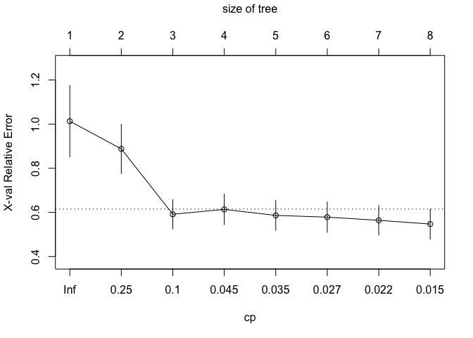
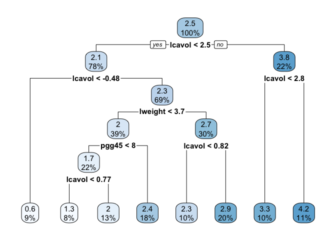
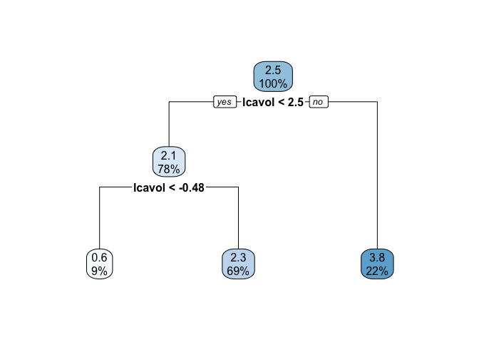
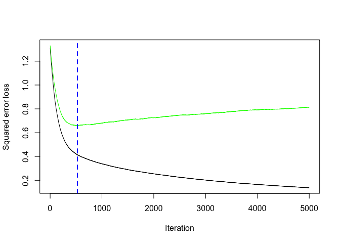
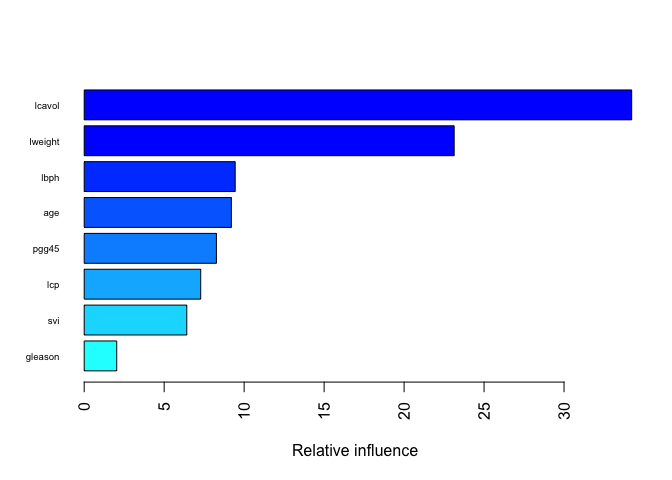
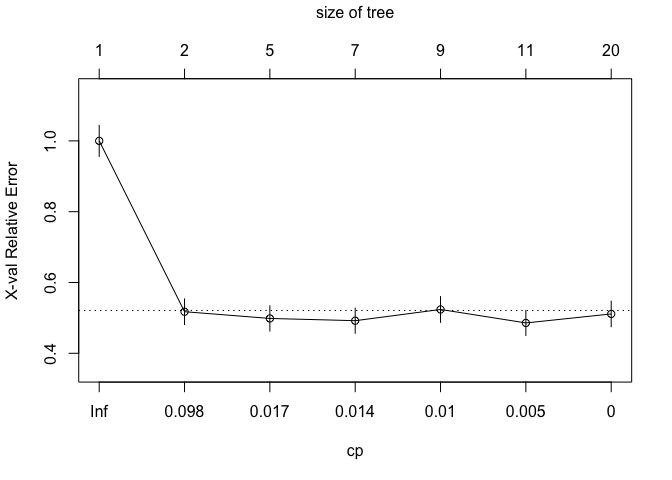
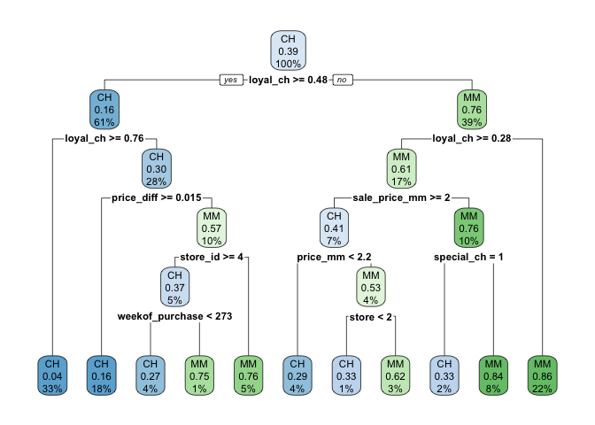
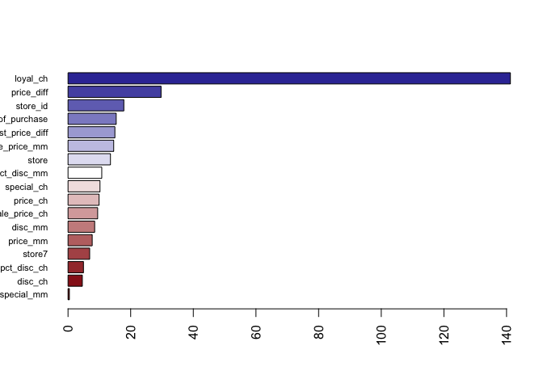
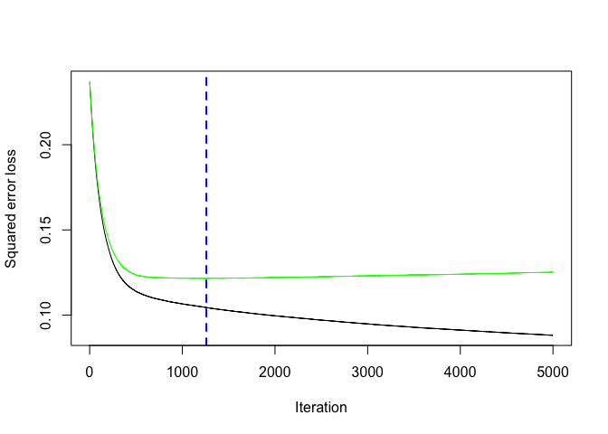
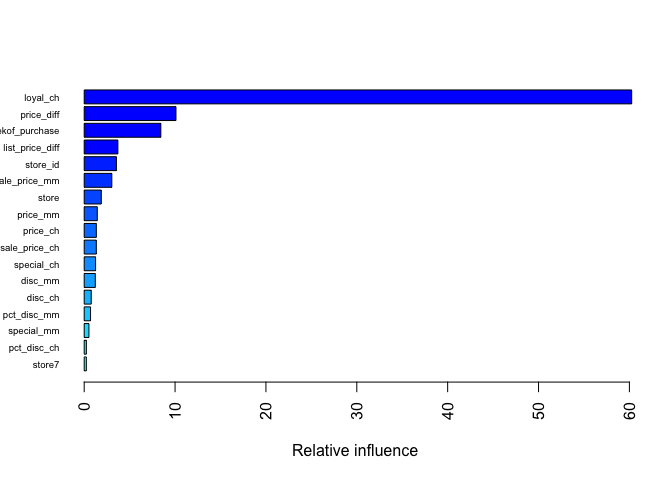

Homework 4
================
Adeline Shin
4/26/2020

# Problem 1

## Loading and Cleaning the Data

``` r
data("Prostate")
prostate_df = Prostate
```

## Part A: Regression Tree

``` r
# Building the initial tree
tree_1 = rpart(formula = lpsa ~ ., data = prostate_df)
rpart.plot(tree_1)
```

<!-- -->

``` r
# Pruning to determine size of best tree
cpTable = printcp(tree_1)
```

    ## 
    ## Regression tree:
    ## rpart(formula = lpsa ~ ., data = prostate_df)
    ## 
    ## Variables actually used in tree construction:
    ## [1] lcavol  lweight pgg45  
    ## 
    ## Root node error: 127.92/97 = 1.3187
    ## 
    ## n= 97 
    ## 
    ##         CP nsplit rel error  xerror     xstd
    ## 1 0.347108      0   1.00000 1.01323 0.162162
    ## 2 0.184647      1   0.65289 0.88779 0.111915
    ## 3 0.059316      2   0.46824 0.59168 0.066102
    ## 4 0.034756      3   0.40893 0.61359 0.069269
    ## 5 0.034609      4   0.37417 0.58640 0.067630
    ## 6 0.021564      5   0.33956 0.57853 0.068772
    ## 7 0.021470      6   0.31800 0.56398 0.067155
    ## 8 0.010000      7   0.29653 0.54721 0.068034

``` r
plotcp(tree_1)
```

<!-- -->

``` r
minErr = which.min(cpTable[, 4])

# Tree with minimum CV
min_cv_tree = prune(tree_1, cp = cpTable[minErr, 1])
rpart.plot(min_cv_tree)
```

<!-- -->

``` r
# Tree with 1 SE rule
se_tree = prune(tree_1, cp = cpTable[cpTable[, 4] < cpTable[minErr, 4]+cpTable[minErr, 5], 1][1])
rpart.plot(se_tree)
```

<!-- -->

As shown above, the tree obtained with the minimum CV is not the same as
that obtained with the 1 SE rule. The tree that corresponds to the
minimum cross-validation error has a size of 8, while the tree obtained
with the 1 SE rule only has a size of 3.

## Part B: Final Tree Plot

Looking above at the cp plot from Part A, the left-most cp with the mean
relative error below the horizontal line is cp = 0.1. Therefore, this
value will be used to plot the final chosen tree, which is the same as
the tree obtained using the 1 SE
rule.

``` r
final_tree = rpart(formula = lpsa ~ ., data = prostate_df, control = rpart.control(cp = 0.1))
rpart.plot(final_tree)
```

<!-- -->

The left-most node on this tree means that of

## Part C: Bagging

``` r
set.seed(1)
bagging = randomForest(lpsa ~ ., data = prostate_df, mtry = 8)
bagging$importance
```

    ##         IncNodePurity
    ## lcavol      76.557359
    ## lweight     16.761566
    ## age          5.875410
    ## lbph         5.123664
    ## svi          6.534788
    ## lcp          5.937665
    ## gleason      1.096503
    ## pgg45        5.776304

The matrix of variable importances is shown above, with the values
signifying each of the variable’s importance in the random forest model.

## Part D: Random Forest

``` r
set.seed(1)
rf = randomForest(lpsa ~ ., data = prostate_df, mtry = 2)
rf$importance
```

    ##         IncNodePurity
    ## lcavol      34.596465
    ## lweight     18.743420
    ## age          8.892790
    ## lbph         7.317636
    ## svi         12.180308
    ## lcp         14.213581
    ## gleason      7.015983
    ## pgg45       11.246124

The variable importance matrix above shows that the value of importance
changes between the random forest model and the bagging model done in
Part C.

## Part E: Boosting

``` r
set.seed(1)
boosting = gbm(lpsa ~ ., data = prostate_df,
               distribution = "gaussian",
               n.trees = 5000,
               interaction.depth = 3,
               shrinkage = 0.005,
               cv.folds = 10)

nt = gbm.perf(boosting, method = "cv")
```

<!-- -->

According to the graph above, the number of trees that should be added
to the ensemble is 527. In addition, the graph below shows the variable
importance in the bagging model.

``` r
summary(boosting, las = 2, cBars = 19, cex.names = 0.6)
```

<!-- -->

    ##             var   rel.inf
    ## lcavol   lcavol 34.229553
    ## lweight lweight 23.131175
    ## lbph       lbph  9.440119
    ## age         age  9.200945
    ## pgg45     pgg45  8.265846
    ## lcp         lcp  7.284989
    ## svi         svi  6.413949
    ## gleason gleason  2.033425

## Part F: Model Comparison

# Problem 2

## Loading and Cleaning the Data

``` r
data(OJ)
oj_data = OJ %>% 
  janitor::clean_names()

set.seed(1)
rowTrain = createDataPartition(y = oj_data$pct_disc_ch,
                               p = 800/1070,
                               list = FALSE)
training_data = as.data.frame(oj_data[rowTrain,])
test_data = as.data.frame(oj_data[-rowTrain,])
```

## Part A: Classification Forest

``` r
# Initial classification tree
set.seed(1)
class_tree = rpart(formula = purchase ~ ., data = oj_data,
                   subset = rowTrain,
                   control = rpart.control(cp = 0))
```

Using the cross-validation error plot, the final tree with the minimum
error is shown below.

``` r
cpTable = printcp(class_tree)
```

    ## 
    ## Classification tree:
    ## rpart(formula = purchase ~ ., data = oj_data, subset = rowTrain, 
    ##     control = rpart.control(cp = 0))
    ## 
    ## Variables actually used in tree construction:
    ##  [1] loyal_ch        price_ch        price_diff      price_mm       
    ##  [5] sale_price_ch   sale_price_mm   special_ch      store          
    ##  [9] store_id        weekof_purchase
    ## 
    ## Root node error: 315/800 = 0.39375
    ## 
    ## n= 800 
    ## 
    ##          CP nsplit rel error  xerror     xstd
    ## 1 0.5047619      0   1.00000 1.00000 0.043870
    ## 2 0.0190476      1   0.49524 0.51746 0.036167
    ## 3 0.0158730      4   0.42540 0.49841 0.035662
    ## 4 0.0126984      6   0.39365 0.49206 0.035489
    ## 5 0.0079365      8   0.36825 0.52381 0.036331
    ## 6 0.0031746     10   0.35238 0.48571 0.035314
    ## 7 0.0000000     19   0.32381 0.51111 0.036000

``` r
plotcp(class_tree)
```

<!-- -->

``` r
minErr = which.min(cpTable[,4])

# Using minimum cross-validation error
tree2 = prune(class_tree, cp = cpTable[minErr,1])
rpart.plot(tree2)
```

<!-- -->

The response prediction can be shown below, as well as the MSE
calculation as the test error.

``` r
rpart_predict = predict(class_tree, newdata = test_data)
rpart_mse = mse(rpart_predict, test_data$purchase)
```

When using the training data to predict the response, the test
classification MSE is , which means the classification error rate is %.

## Part B: Random Forest

``` r
set.seed(1)
rf_2_final = ranger::ranger(purchase ~ ., data = oj_data,
                            mtry = 10,
                            splitrule = "gini",
                            min.node.size = 5,
                            importance = "permutation",
                            scale.permutation.importance = TRUE)

barplot(sort(ranger::importance(rf_2_final), decreasing = FALSE),
        las = 2, horiz = TRUE, cex.names = 0.7,
        col = colorRampPalette(colors = c("darkred", "white", "darkblue"))(19))
```

<!-- -->

The test error rate is

## Part C: Boosting

``` r
set.seed(1)
boosting_2 = gbm(purchase ~ ., data = oj_data,
                 distribution = "gaussian",
                 n.trees = 5000,
                 interaction.depth = 3,
                 shrinkage = 0.005,
                 cv.folds = 10)
```

``` r
nt_2 = gbm.perf(boosting_2, method = "cv")
```

<!-- -->

The graph above shows the number of trees that should be included, which
is 1259. Below, a bar graph of the relative variable importance is shown
for the boosting model.

``` r
summary(boosting_2, las = 2, cBars = 19, cex.names = 0.6)
```

<!-- -->

    ##                             var    rel.inf
    ## loyal_ch               loyal_ch 60.2518291
    ## price_diff           price_diff 10.1007283
    ## weekof_purchase weekof_purchase  8.4342363
    ## list_price_diff list_price_diff  3.7070349
    ## store_id               store_id  3.5435204
    ## sale_price_mm     sale_price_mm  3.0407722
    ## store                     store  1.8797207
    ## price_mm               price_mm  1.4388640
    ## price_ch               price_ch  1.3336801
    ## sale_price_ch     sale_price_ch  1.3333152
    ## special_ch           special_ch  1.2525855
    ## disc_mm                 disc_mm  1.2222449
    ## disc_ch                 disc_ch  0.7726674
    ## pct_disc_mm         pct_disc_mm  0.6977564
    ## special_mm           special_mm  0.5205055
    ## pct_disc_ch         pct_disc_ch  0.2368019
    ## store7                   store7  0.2337371

The test error rate
